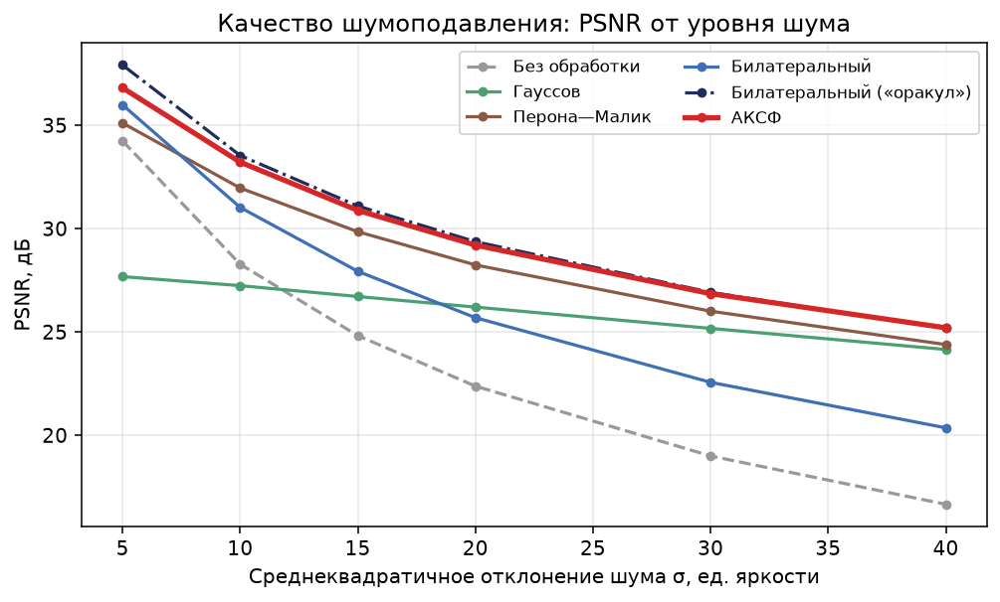

# ACSF — adaptive image smoothing in Rust

[](https://github.com/kaktoraz/rastirization/actions/workflows/ci.yml?query=branch%3Aarena%2F01a1074a-rastirization)
[](https://github.com/kaktoraz/rastirization/actions/workflows/benchmark.yml?query=branch%3Aarena%2F01a1074a-rastirization)

[Русская версия](README.md) · **English**

An educational image-denoising project implementing an **Adaptive
Contrast-Structural Filter (ACSF)**. ACSF is presented honestly as a transparent
extension of the bilateral-filter idea, not as a claim of a new world-first
algorithm. The implementation is in Rust; filtering algorithms, metrics, and
the noise generator are implemented in this repository. The
[`image`](https://crates.io/crates/image) crate is used only for file I/O.

- [Russian DOCX report](docs/Отчёт_Сглаживание_изображений.docx)
- [Russian PPTX deck — 11 slides with speaker notes](docs/Презентация_Сглаживание_изображений.pptx)
- [Russian talk track and Q&A](docs/Речь_для_выступления.md)
- [Full grayscale summary](results/tables/table_summary.md) · [paired t-test](results/tables/significance_summary.md) · [YCbCr colour summary](results/color/tables/table_summary.md)

## Method

For a noisy grayscale input, ACSF:

1. estimates the noise standard deviation `σ̂` using Immerkaer’s estimator;
2. calculates a 5×5 noise-compensated structural-activity map:

   ```text
   A(p) = sqrt(max(0, V(p) − σ̂²));
   ```

3. adapts the bilateral range parameter at every pixel:

   ```text
   σr(p) = σ̂ [kmin + (kmax − kmin) exp(−(A(p)/(cσ̂))²)];
   ```

4. applies bilateral weighting in an 11×11 neighbourhood.

Thus, smoothing is strong in flat areas and restrained near edges or texture.
The final configuration was calibrated **only on `σ={20,30}`**:

| Parameter | Value |
|---|---:|
| `σs` | 2.0 |
| `kmin`, `kmax`, `c` | 0.85, 3.6, 1.3 |
| filter / activity radius | 5 / 2 |

Calibration candidates are retained in
[`results/tables/calibration.csv`](results/tables/calibration.csv); levels
`σ={5,10,15,40}` were not used to choose these values.

## Latest reproducible result

The grayscale protocol contains **6 scenes × 6 noise levels**
`σ={5,10,15,20,30,40}`, with seed `12345` and identical noisy inputs for every
method. Numbers and plots are generated from `results/tables/results.csv` by
`analysis.py`.

| Method | PSNR, dB | SSIM | EPI | Time, ms |
|---|---:|---:|---:|---:|
| Gaussian | 26.19 | 0.6584 | 0.3272 | 3.5 |
| Perona–Malik (own implementation) | 29.25 | 0.7633 | 0.5399 | 55.0 |
| Bilateral | 27.25 | 0.5980 | 0.4958 | 64.6 |
| Bilateral “oracle”¹ | 30.66 | 0.7989 | 0.6018 | — |
| ACSF without adaptation | 29.60 | 0.7680 | 0.6005 | 18.8 |
| **ACSF** | **30.35** | **0.7978** | **0.6340** | **19.9** |

¹ The oracle selects bilateral parameters using the clean reference. It is a
diagnostic upper bound, not a deployable method or a timing baseline.

Across four real 512×512 scenes, public ACSF averaged **19.38 ms**, below the
30 ms target. A regression test compares its public separable path against the
preserved exact 2D implementation at the same estimated `σ̂`; a PSNR loss above
0.05 dB fails the test.

### Statistical result

Bilateral and ACSF were repeated for 30 independent paired seeds. One pair is
the mean over all 36 image/noise tasks for one seed, not an individual pixel or
frame. The mean ACSF advantage is **+3.099 dB**; a one-sided paired t-test gives
`p = 2.17e−84 < 0.05`.

### Real colour YCbCr mode

This is not three independent RGB filters. In the RGB→YCbCr mode the activity
map and `σr(p)` are calculated from luminance `Y`, while `Y`, `Cb`, and `Cr` are
filtered jointly with a chroma-aware weight. On 3 colour scenes × 6 noise
levels, ACSF scored **31.23 dB / 0.8413 SSIM / 0.2728 EPI / 125.2 ms** versus
bilateral **28.65 dB / 0.6053 / 0.2479 / 121.1 ms**. See
[`results/color/tables`](results/color/tables/) for the complete data.



## Quick start

### Requirements

- stable Rust (`cargo`; verified in GitHub Actions);
- Python 3.10+ only for plots and documents;
- `numpy`, `matplotlib`, `pillow` for plots;
- `python-docx`, `python-pptx` for DOCX/PPTX generation.

```bash
cargo build --release --locked
./target/release/smoothing_project
```

### Denoise one file

```bash
# Grayscale; --sigma adds controlled AWGN before filtering
./target/release/smoothing_project denoise \
  -i data/clean/baboon.png -o out.png -m acsf --sigma 20 --seed 12345

# Actual joint YCbCr colour mode
./target/release/smoothing_project denoise \
  --rgb -i data/color/fruits.jpg -o out_colour.png -m acsf --sigma 20 --seed 12345
```

Supported `-m` methods: `box`, `gauss`, `median`, `perona`, `bilateral`, and
`acsf`.

### Reproduce the experiment

```bash
# Grayscale protocol and sigma=20 visual outputs
./target/release/smoothing_project bench \
  -d data/clean -o results --noise 5,10,15,20,30,40 \
  --save-sigma 20 --seed 12345

# 30 paired seeds for bilateral versus ACSF
./target/release/smoothing_project stats \
  -d data/clean -o results --noise 5,10,15,20,30,40 \
  --runs 30 --seed 12345

# Colour YCbCr protocol
./target/release/smoothing_project bench --rgb \
  -d data/color -o results/color --noise 5,10,15,20,30,40 \
  --save-sigma 20 --seed 12345

# Derive tables, plots, report, deck, and talk track
python3 analysis.py
python3 visualize.py --sigma 20
python3 analysis.py --color
python3 docs/build_report.py
python3 docs/build_slides.py
```

The short CLI help is printed when the binary is run without a subcommand.
`-i`/`--input` and `-o`/`--output` are equivalent.

## Performance implementation

| Part | Change |
|---|---|
| activity map | two integral images for local sum and sum of squares |
| range weight | linearly interpolated `exp(−x)` lookup table |
| spatial part | two separable passes with original guidance in the second pass |
| safety | exact 2D path retained for the unit/regression test |

A fixed historical benchmark progressed **241.9 → 70.9 → 20.47 ms** (direct
2D → integral-image exact 2D → public separable implementation). The expanded
current protocol confirms 19.38 ms on 512×512 scenes.

## Repository layout and data

```text
src/
  filters.rs      filters, ACSF, Perona–Malik, joint YCbCr weights, tests
  experiment.rs   unified protocol, CSV, colour and statistical runs
  metrics.rs      PSNR, SSIM, EPI, MSE, Immerkaer estimator
  noise.rs        deterministic AWGN (xorshift64* + Box–Muller)
  img.rs          GrayF/YCbCrF and RGB↔YCbCr
  main.rs         CLI
data/
  clean/          6 grayscale scenes
  color/          3 RGB scenes for YCbCr
  ATTRIBUTION.md  sources and licences
results/
  tables/         CSV, summary.json, Markdown tables, statistics, calibration
  plots/          charts and visual panels for the documents
  logs/           reproducible-command output
```

Intermediate `results/**/images/`, `target/`, `my_results/`, and archives are
ignored by Git. `data/generate_synthetic.py` deterministically creates
`gradient_circles.png`. Source and licensing notes for the test scenes are in
[`data/ATTRIBUTION.md`](data/ATTRIBUTION.md).

## Reproducibility and CI

The **Reproducible experiment** workflow builds the release binary and runs the
grayscale, calibration, paired-statistics, and colour protocols on this branch.
It derives the plots/tables and stores them in the repository. The **CI**
workflow runs `cargo fmt --check`, the release build, and all unit tests. As a
result, CSVs, figures, DOCX, and PPTX have one source of numeric data.

## Limitations

- Only additive white Gaussian noise is evaluated; salt-and-pepper and real
  sensor/camera noise need their own experiments.
- The oracle is not a practical baseline.
- The calibration grid is limited; it should not be expanded using test levels
  without a fresh train/test split.
- Timings depend on the CPU/runner; compare them within one run.

## License

See [LICENSE](LICENSE). Test scenes have their own terms, listed in
[data/ATTRIBUTION.md](data/ATTRIBUTION.md).
